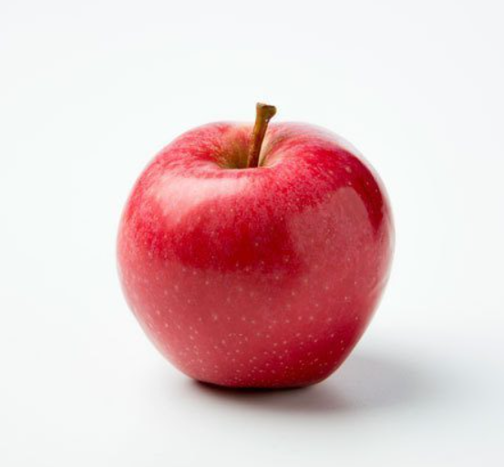

# Customisable Colour Based Object Detection
 
 It uses colour range to detect objects present in an image with the colour specified. The colour can be updated as per requirement in the colour_recognition.py file.

# To run:

1. download all the necessary packages from the requirement.txt file by running `pip install -r requirements.txt` in the command prompt.
2. run the colour_recognition.py file using `py colour_recognition.py`

# Input image

# Output image

